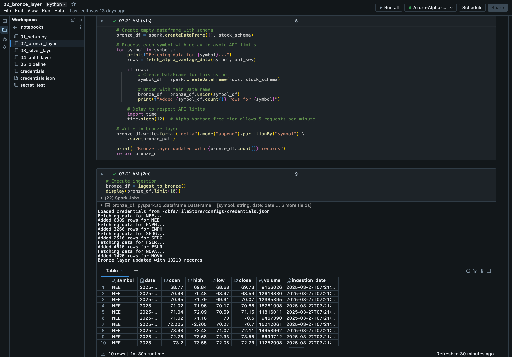
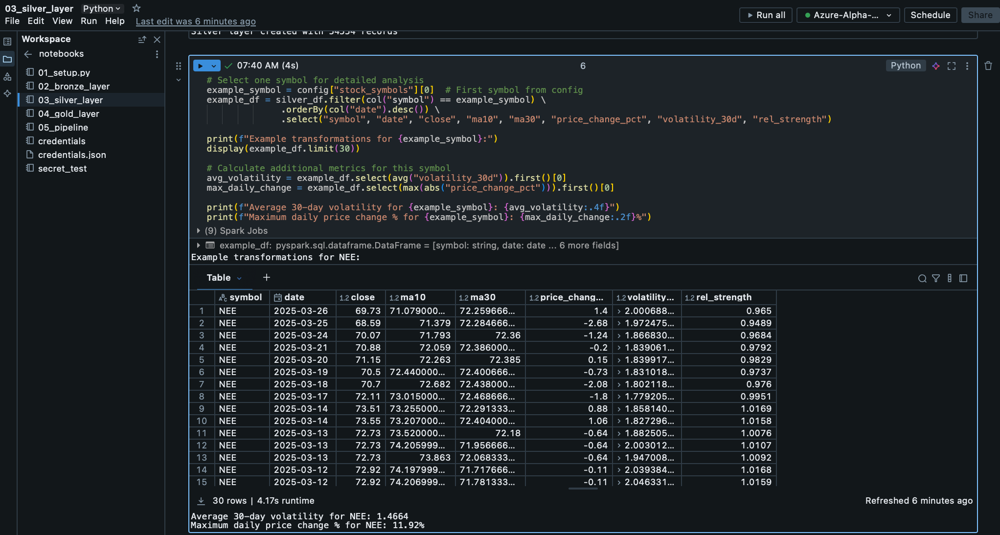
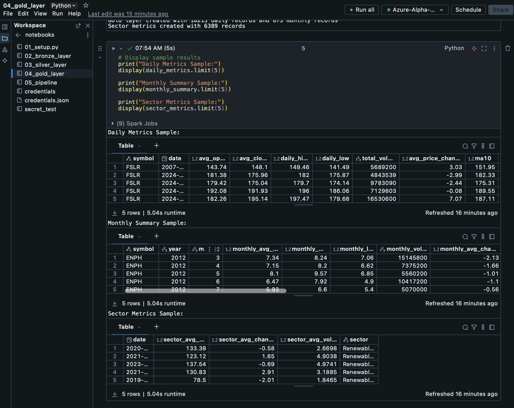
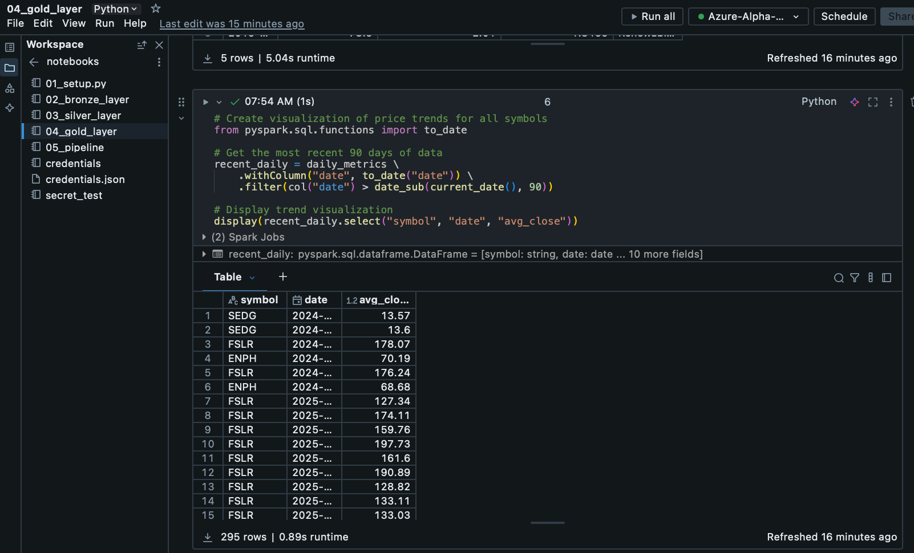
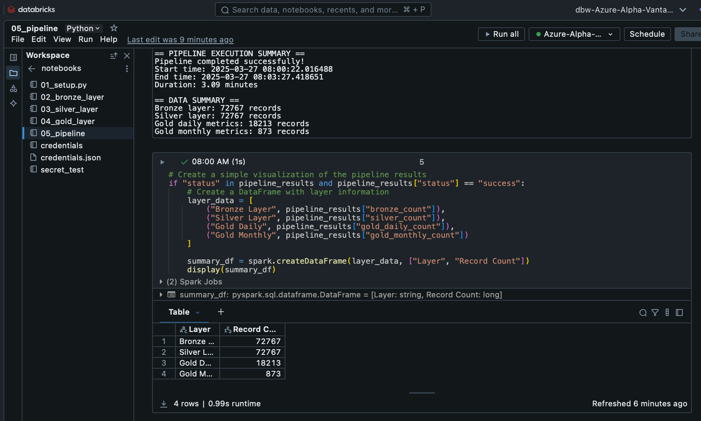

# Azure-Alpha-Vantage: Renewable Energy Stock Analysis Pipeline

A data engineering project that demonstrates building an ETL pipeline with Azure Databricks, processing financial data from Alpha Vantage API using the medallion architecture.

## Project Overview

This project implements a comprehensive data pipeline that:

- Extracts stock market data for renewable energy companies from Alpha Vantage API
- Processes and transforms the data through Bronze, Silver, and Gold layers
- Creates analytics-ready views for financial analysis
- Orchestrates the entire workflow in Azure Databricks

## Architecture

### Medallion Architecture Implementation

- **Bronze Layer**: Raw data from Alpha Vantage
- **Silver Layer**: Cleansed and enriched data with technical indicators
- **Gold Layer**: Analytics-ready aggregated views

## Technologies Used

- Azure Databricks
- PySpark
- Delta Lake
- Azure Data Lake Storage Gen2
- Alpha Vantage API

## Project Structure

Azure-Alpha-Vantage/
├── notebooks/ # Databricks notebooks
│ ├── 01_setup_and_mount.py
│ ├── 02_bronze_layer.py # Alpha Vantage API ingestion
│ ├── 03_silver_layer.py # Data cleansing and enrichment
│ ├── 04_gold_layer.py # Analytics aggregations
│ └── 05_pipeline.py # Main workflow orchestration
└── config/
└── config.json # Configuration file

## Implementation Results

### Data Ingestion (Bronze Layer)

### Data Transformation (Silver Layer)

### Data Analytics (Gold Layer)

### Complete Pipeline Execution

## Key Features

- Renewable energy sector focus
- Technical indicator calculation (MA, volatility, RSI)
- Incremental data processing
- Optimized partitioning for query performance
- Complete pipeline orchestration

## Future Work

- Add machine learning predictions for renewable energy stocks
- Implement real-time data streaming
- Create Power BI dashboards
- Add correlation analysis across the renewable energy sector
